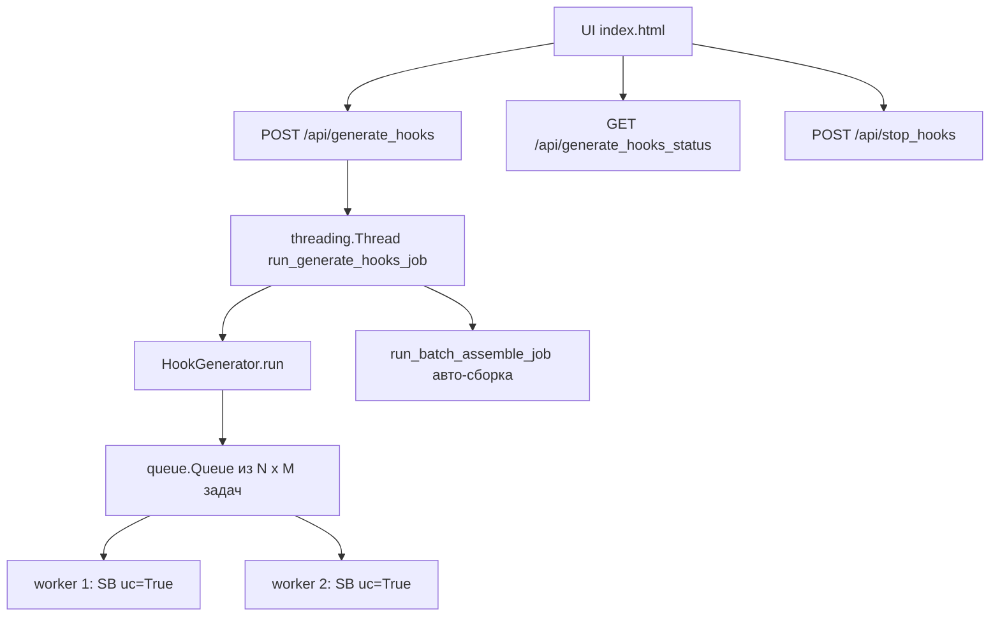
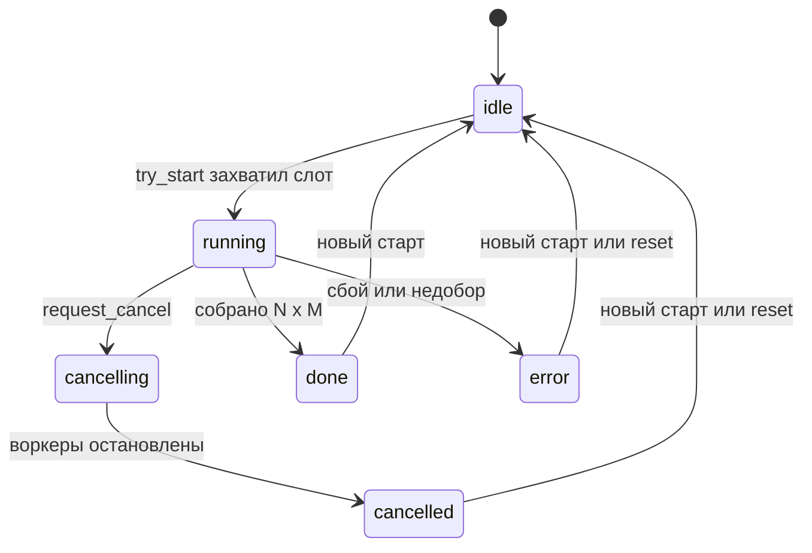
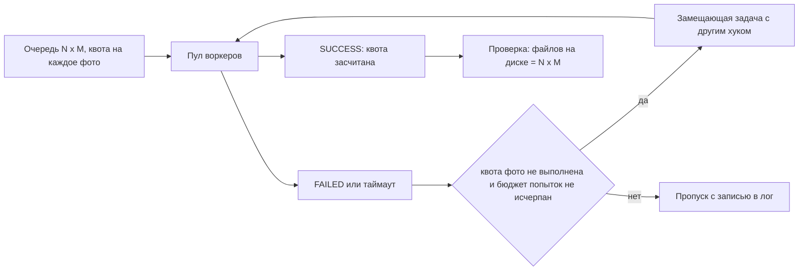

# ClipForge — переработка исполнительной части: стабильность, таймауты, многопоточность

Документ объясняет **что было сломано** (по коду), **почему** программа зависала после
завершения задачи, и **как это решено**. Пункты соответствуют требованиям 5–8.

---

## 1. Разбор прежнего кода

### 1.1 Как всё было устроено



Состояние всего приложения жило в одном глобальном словаре `HOOK_GEN_JOB` и одном
модульном `_cancel_event`. Это корень почти всех дефектов.

### 1.2 Причины зависания (пункты 5 и 6)

| # | Дефект | Следствие |
|---|--------|-----------|
| D1 | «Мягкая» отмена по `threading.Event`: таймер лишь выставлял флаг, который читался на редких чекпоинтах | Поток, залипший внутри `uc_open_with_reconnect`, `choose_file` или ожидания OTP, флаг не читал вообще |
| D2 | `for t in threads: t.join()` **без таймаута** | Один зависший воркер держал задачу в `running` бесконечно. Это и есть наблюдаемое зависание |
| D3 | `_cancel_event` — модульная переменная, которую `_reset_hook_job_state` **переприсваивала** новым объектом, а воркеры держали ссылку на старый | «Стоп» перестаёт работать. Сама функция при этом нигде не вызывалась — мёртвый код |
| D4 | `/api/stop_hooks` сразу ставил `state=idle`, хотя воркеры ещё живы | Guard `if state == running` пропускал **вторую** генерацию поверх первой |
| D5 | Новый запуск делал `_cancel_event.clear()` | Снимал отмену со старых, ещё не умерших воркеров: те работали вечно |
| D6 | Порт DevTools считался как `9222 + wid*10 + attempt`, имена файлов брались от `max(existing)` | Коллизии портов и перезапись `hook_XXX.mp4` при параллельных прогонах; Chrome не поднимался, поток вставал |
| D7 | На успехе `state` никогда не становился `done`; в `finally` `running` → `idle` | Контракт состояний расходился с ожиданиями UI |
| D8 | `run_batch_assemble_job` при ошибке оставлял `state=error` и не чистил `log/done/total` | Следующая задача стартовала с мусорным прогрессом |
| D9 | Параллельная инициализация SeleniumBase конкурировала за общие lock-файлы (`driver_fixing.lock`, `pipfinding.lock`) | При `workers > 1` первый запуск мог встать на блокировке скачивания драйвера |

### 1.3 Таймауты (пункт 7)

* `timeout_gen` применялся несогласованно: как `threading.Timer` на всю попытку и
  как лимит цикла ожидания внутри `_generate_and_download`. У регистрации,
  onboarding и загрузки файлов бюджета не было вовсе, поэтому реальная попытка
  занимала `timeout_gen + OTP 180с + …`.
* Все внутренние ожидания — фиксированные `time.sleep`, которые не прерывались ни
  отменой, ни дедлайном.

### 1.4 NSFW (пункт 7)

* Детектор сканировал **весь** `document.body.innerText` по подстрокам `violat`,
  `flagged`, `rejected`, `content policy`. Обычный футер с Terms/Policy давал
  ложное срабатывание → бесконечная ротация хуков и сожжённый бюджет повторов.
* NSFW увеличивал `attempt`, то есть **расходовал** повторы.
* `random.choice` при 1–2 видео возвращал тот же хук — ротации не происходило.

### 1.5 Строгое равенство N × M (пункт 8)

* Очередь строилась как N × M верно, но провалившиеся задачи никто не восполнял.
* `return 0 if success > 0 else 1` считал прогон успешным даже при 1 из 60.

---

## 2. Что реализовано

### 2.1 Единый менеджер задач [`clipforge/clipforge/jobs.py`](clipforge/clipforge/jobs.py)



* [`JobManager.try_start()`](clipforge/clipforge/jobs.py:88) — **атомарный захват
  единственного слота** под локом: двойной старт технически невозможен (лечит D4).
* `cancel_event` лежит **внутри** объекта [`Job`](clipforge/clipforge/jobs.py:45),
  никогда не переприсваивается и не сбрасывается новым запуском (лечит D3, D5).
* [`finalize()`](clipforge/clipforge/jobs.py:170) вызывается в `finally` рабочего
  потока: **всегда** освобождает слот, фиксирует терминальное состояние и пишет в
  лог «Готов к новой задаче» (лечит D7, D8 — прямое требование пункта 6).
* [`register_killer()`](clipforge/clipforge/jobs.py:139) — колбэки принудительного
  закрытия браузера, которые вызываются при отмене.
* **Watchdog-поток** [`_watch()`](clipforge/clipforge/jobs.py:266): если heartbeat
  задачи старше `stall_timeout` (120 с), задача снимается принудительно, слот
  освобождается (страховка от D2).
* [`reset()`](clipforge/clipforge/jobs.py:196) + `kill_orphan_browsers()` — аварийный
  возврат в `idle` с очисткой временных профилей `cf_w*` и осиротевших процессов.

### 2.2 Жёсткие таймауты и прерываемые ожидания

Введены [`Deadline`](clipforge/clipforge/generate_hooks.py:127) и
[`interruptible_wait()`](clipforge/clipforge/generate_hooks.py:169):

| Параметр | По умолчанию | Смысл |
|---|---|---|
| `timeout_gen` | 300 с | ожидание готового видео |
| `timeout_attempt` | 900 с | полный бюджет попытки: регистрация + onboarding + загрузка + генерация + скачивание |
| `stall_timeout` | 120 с | отсутствие heartbeat активной задачи |

* Все **64** вызова `time.sleep` внутри `HookGenerator` заменены на
  [`self._wait()`](clipforge/clipforge/generate_hooks.py:551) — пауза прерывается
  отменой и дедлайном за ~0.25 с.
* Ожидание OTP ограничено остатком бюджета попытки и принимает `cancel`/`deadline`
  ([`get_otp_code`](clipforge/clipforge/generate_hooks.py:275)).
* Контекст попытки хранится в `threading.local`, поэтому воркеры не перетирают
  дедлайны друг друга.
* **Hard-kill сторож попытки**: по истечении дедлайна или при отмене отдельный поток
  вызывает [`hard_kill_driver()`](clipforge/clipforge/generate_hooks.py:204) —
  `driver.quit()` плюс `kill()` процесса службы. Блокирующий вызов Selenium в рабочем
  потоке немедленно падает исключением. Это единственный надёжный способ разморозить
  поток (лечит D1).
* Порт DevTools выделяется через [`free_port()`](clipforge/clipforge/generate_hooks.py:190)
  (`socket.bind(0)`), профиль — через `mkdtemp` (лечит D6).
* [`_warmup_driver()`](clipforge/clipforge/generate_hooks.py:2444) один раз поднимает
  браузер до старта пула, снимая гонку за lock-файлы SeleniumBase (лечит D9).
* Ожидание воркеров: цикл с `join(timeout=1.0)`, добивание при простое дольше
  `timeout_attempt + 120`, гарантированный выход из `run()` (лечит D2).

### 2.3 Повторы и ротация хука при NSFW

* `max_retries` (0–3) — бюджет **технических** ошибок.
* `nsfw_rotations` (по умолчанию 3) — **отдельный** бюджет: NSFW не расходует
  повторы, просто берётся другой хук и генерация стартует заново с новым аккаунтом
  и чистым браузером.
* [`rotate_hook()`](clipforge/clipforge/generate_hooks.py:81) идёт по списку
  циклически — файл гарантированно другой.
* Детектор [`_check_nsfw_error()`](clipforge/clipforge/generate_hooks.py:2400) сужен
  до контейнеров `[role=alert]`, `[role=status]`, `[role=dialog]`, `toast`,
  `snackbar`, `notification` и точных фраз (`nsfw`, `content policy violation`,
  `flagged as inappropriate`, `prohibited content`, …). Текст уведомления попадает
  в лог целиком, чтобы ложные срабатывания были видны.

### 2.4 Гарантия ровно N × M



* Координатор ведёт `model_quota` и создаёт **замещающие** задачи только для фото с
  недобором → распределение остаётся ровным.
* Предохранитель `attempts_budget = N*M*(1+max_retries) + N*M` не даёт добору стать
  бесконечным при систематическом сбое.
* Индексы выходных файлов резервируются атомарно (`reserve_output` под локом).
* Финальная верификация считает файлы на диске, печатает разбивку по каждому фото и
  возвращает `0` только при полном комплекте. При недоборе — понятная диагностика
  без падения процесса.

### 2.5 Дефекты, найденные живым прогоном

Первые прогоны против настоящего Higgsfield выявили четыре дефекта, которых не
было видно на заглушках.

**Illegal return statement.** В UC-режиме SeleniumBase уходит на CDP
`Runtime.evaluate`, где верхнеуровневый `return` — синтаксическая ошибка. Часть
скриптов (переключатель Video/Image, выбор модели, загрузка файлов) молча
падала, а сайт затем отвечал «Input Video Required». Исправлено двумя шагами:
все скрипты обёрнуты в IIFE, а метод
[`_js()`](clipforge/clipforge/generate_hooks.py:557) один раз определяет режим
и дальше отправляет скрипт в подходящей форме — с `return` либо как выражение.

**Незакрытое окно перекрывало форму.** Модальное окно «ORGANIZE. SHARE. CREATE
TOGETHER» не входило в список маркеров `_close_popups`, перехватывало клики, и
видео не прикреплялось. Маркеры расширены, добавлен
[`_goto()`](clipforge/clipforge/generate_hooks.py:1739), который закрывает
всплывающие окна сразу после перехода, а не на отдельных шагах позже. Плюс
появилась проверка
[`_verify_video_attached()`](clipforge/clipforge/generate_hooks.py:2065): если
сайт видео не принял, попытка падает сразу, а не ждёт результат весь
`timeout_gen` впустую.

**Скачивание не работало.** `urllib.request.urlretrieve` уходит с
User-Agent «Python-urllib», и CloudFront такие запросы отклоняет: генерация
завершалась успешно, URL находился, но файл не сохранялся. Новый
[`_download_video()`](clipforge/clipforge/generate_hooks.py:2650) шлёт
браузерные заголовки, читает поток чанками, проверяет размер и пишет через
временный `.part`. Заодно теперь используется URL, который нашёл детектор
завершения (раньше он вычислялся и игнорировался).

**Машинный ввод email.** `sb.type()` вставляет строку мгновенно, Clerk не
всегда успевает провалидировать поле. Добавлен
[`_type_slow()`](clipforge/clipforge/generate_hooks.py:533) — посимвольный ввод
с небольшим разбросом задержки.

Дополнительно heartbeat теперь отправляется на каждом шаге сценария (через
`_wait`), а не только по завершении задачи, — детектор зависания реагирует на
реальное залипание, а не через `timeout_attempt + 120` от старта.

### 2.6 Панель UI — только генерация

По решению заказчика вся сборка монтажа убрана из веб-панели: удалены выбор режима
батча, уникализация, папка готовых роликов, чекбокс авто-сборки и кнопка «Собрать
ролики», а также эндпоинт `/api/batch_assemble` и функция `run_batch_assemble_job`.
Сборка по-прежнему доступна из CLI ([`clipforge/clipforge/batch.py`](clipforge/clipforge/batch.py),
флаг `--batch` в [`clipforge/clipforge/cli.py`](clipforge/clipforge/cli.py)).

Что появилось в панели:

* поля «Таймаут генерации», «Таймаут всей попытки», «Повторы при ошибке»,
  «Смен хука при NSFW»;
* состояние `cancelling`: «Стоп» блокируется, «Старт» разблокируется **только**
  после освобождения слота;
* кнопка «Сбросить состояние» → `POST /api/reset_hooks`;
* строка статуса показывает `done/total`, число провалов, фазу и возраст heartbeat;
* поле «Всего нужно хуков» убрано: итог всегда считается как N × M.

---

## 3. Изменённые файлы

| Файл | Что сделано |
|---|---|
| [`clipforge/clipforge/jobs.py`](clipforge/clipforge/jobs.py) | **новый**: `Job`, `JobManager`, watchdog, hard-kill, reset, очистка профилей |
| [`clipforge/clipforge/generate_hooks.py`](clipforge/clipforge/generate_hooks.py) | `Deadline`, `interruptible_wait`, `free_port`, `hard_kill_driver`, прогрев драйвера, сторож попытки, координатор квот N × M, отдельный бюджет NSFW, сужение детектора, `join` с таймаутом, флаги `--timeout-attempt` и `--nsfw-rotations` |
| [`clipforge/clipforge/server.py`](clipforge/clipforge/server.py) | переход на `JobManager`, атомарный старт, корректные `stop`/`reset`, расширенный статус, удалены авто-сборка и `/api/batch_assemble` |
| [`clipforge/clipforge/ui/index.html`](clipforge/clipforge/ui/index.html) | панель только для генерации, новые настройки, состояние `cancelling`, кнопка сброса, счётчики |

---

## 4. Результаты проверки

### 4.1 Логика на заглушках — 6 из 6

Регрессионный набор [`clipforge/tests/test_hook_generation.py`](clipforge/tests/test_hook_generation.py)
(SeleniumBase подменён заглушкой, Chrome не поднимается):

| Сценарий | Результат |
|---|---|
| 3 фото × 2 при успехе | ровно 6 файлов `hook_*.mp4`, код возврата 0 |
| каждая вторая попытка падает | замещающие задачи добрали до 6 файлов, код 0 |
| NSFW на каждой попытке | 4 разных хука в рамках задачи, повторы не израсходованы |
| генерация висит 30 с при `timeout_attempt=3` | `run()` вернулся через 31 с |
| отмена через 2 с при двух воркерах | `run()` вернулся через 20 с, браузеры добиты |

### 4.2 HTTP-контракт — 16 из 16

Старт из `idle` с `total = N × M`; второй одновременный старт отклонён;
«Стоп» переводит в `cancelling` и держит слот занятым до остановки воркеров;
после отмены `cancelled` со свободным слотом и записью «Готов к новой задаче»;
повторный запуск без перезапуска доходит до `done` с `2/2`;
`POST /api/reset_hooks` возвращает в `idle`.

### 4.3 Живой прогон против Higgsfield — успешен

Реальный Chrome 150, ключ AnyMessage, 1 фото × 1 генерация:

```
✓ Background: clicked Video toggle
✓ video: choose_file succeeded
✓ Видео прикреплено (проверка пройдена)
✅ New result URL detected! (54s)
✅ Видео сохранено: hook_001.mp4 (11.5 МБ)
✅ Готово ровно 1 видео (N × M соблюдено)
```

### 4.4 Живая отмена — 9 из 9

Отмена во время настоящей генерации (Chrome + сайт):

* слот освободился через 22 с после «Стоп», состояние `cancelled`;
* в логе «Готов к новой задаче»;
* **повторный запуск без перезапуска процесса** принят и снова корректно отменён;
* `reset_hooks` вернул `idle` и удалил осиротевший профиль браузера.

### 4.5 Что не проверялось

Живая ротация при NSFW: за прогоны сайт ни разу не отдал отказ по
контент-политике, поэтому этот путь подтверждён только на заглушке.
Распараллеливание сборки монтажа не делалось — по решению заказчика сборка
убрана из панели и осталась однопоточной в CLI.
